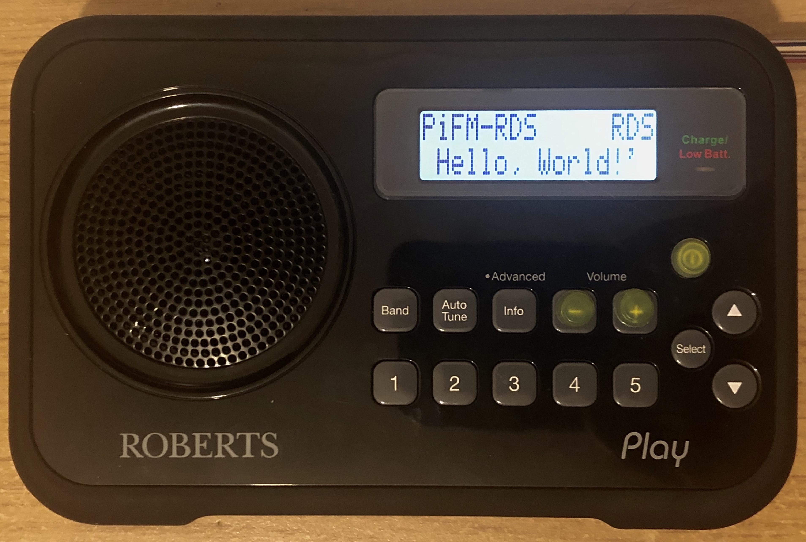

PiFM GTK 1.2
=========


## FM RDS transmitter using the Raspberry Pi

This program generates an FM modulation, with RDS (Radio Data System) data generated in real time as well as having the ability to use both monophonic and stereophonic audio.

PiFmAdv modulates the PLLC instead of the clock divider for increased signal purity, meaning that the signal is also less noisy. This has a great impact on stereo, as it's reception is significantly better.

For the PLLC modulation to be stable there is an additional step. Due to the low-voltage detection, the PLLC frequency can be reduced to a safe value in an attempt to restrict crashes. When this happens, the carrier freqency changes based on the GPU frequency.
To prevent this, we can tweak the GPU freqency to match the safe frequency. Now when due the low voltage detection occurs, the PLLC frequency changes to safe value, meaning nothing happens since the normal value and safe value are identical.

This project is based on an earlier FM transmitter developed by [Oliver Mattos and Oskar Weigl](http://www.icrobotics.co.uk/wiki/index.php/Turning_the_Raspberry_Pi_Into_an_FM_Transmitter), and later adapted to using DMA by [Richard Hirst](https://github.com/richardghirst). Christophe Jacquet manipulated it, adding the RDS data generator and modulator. The transmitter uses the Raspberry Pi's PWM generator to produce VHF signals.

It is compatible with the Raspberry Pi 1, 2, 3, Zero.



PiFmAdv has been developed solely for experimentation purposes only. It is not a media center, nor is it intended to broadcast music to your stereo system. See the [legal warning](#warning-and-disclaimer).

## Installation
PiFM 1.2 depends on a number of prerequisites. To ensure that all of these are in place, first run the `setup.sh` script. This will perform a number of relevant commands to get the transmitter up and running.

Clone or download the source repository and run `setup.sh` in the `PiFM` directory:
```
git clone https://github/com/mundeeplamport/PiFM
chmod 777 /PiFM/seup.sh
./PiFM/setup.sh
```
This will run the installation script for the software and is a fully automated process, but also very verbose, so you can see what it is doing. Please note that your Raspberry Pi will automatically reboot after installation is complete. **For a GUI based installation, double-click on `setup.sh`** and click "execute in terminal", this way you will have a detailed view of the installation procedure.

**Important.** The binaries compiled for the Raspberry Pi 1 are not compatible with the Raspberry Pi 2/3, and conversely. Always re-compile when switching models. To do so, re-run the installer.

## Usage
Find the PiFM shortcut in the applications menu in the 'other' submenu.
Use the shortcut located on the desktop.
Open a terminal window and type `radio` and hit enter, which will directly load the application.

Once loaded, a pop-up will appear giving you information about the software as well as the supported file types. After clicking Begin you will be faced with a series of variables allowing you to change the properties of the FM-RDS transmission. After choosing the final option, the software will start.
Included are a number of sample audio files located in the `src` directory
* `noise_22050.wav` is static sound
* `pulses.wav` is a single pulse
* `sound.wav` is the file for testing signal quality vs. range
* `stereo_44100` allows you to try stereophonic audio

To exit the application, make the terminal window active and click CTRL+C to force-quit the program. This will quit you to the terminal.

## Advanced Users (those confident with a terminal)
You can also use PiFM using the terminal
```
cd /home/pi/PiFM/src
sudo ./PiFM
```
This will generate an FM transmission on 87.6Mhz, with default station name (PS), radiotext (RT) and PI-code (PI), without audio. The radio frequency signal is emitted on GPIO 4 (pin 7 on header P1).
You can add monophonic or stereophonic audio by referencing an audio file as follows:
```
sudo ./PiFM --audio sound.wav
```
To test stereophonic audio, you can try the file `stereo_44100.wav` which has been provided.
```
sudo ./PiFM --audio stereo_44100.wav
```
## All arguments are optional:
* `--freq` specifies the carrier frequency (in MHz). Example: `--freq 87.6`.
* `--audio` specifies an audio file to play as audio. The sample rate does not matter: PiFmAdv will resample and filter it. If a stereo file is provided, PiFmAdv will produce an FM-Stereo signal. Example: `--audio sound.wav`. The supported formats depend on `libsndfile`. This includes WAV and Ogg/Vorbis (among others) but not MP3. Specify `-` as the file name to read audio data on standard input (useful for piping audio into PiFmAdv, see below).
* `--pi` specifies the PI-code of the RDS broadcast. 4 hexadecimal digits. Example: `--pi FFFF`.
* `--ps` specifies the station name (Program Service name, PS) of the RDS broadcast. Limit: 8 characters. Example: `--ps RASP-PI`.
* `--rt` specifies the radiotext (RT) to be transmitted. Limit: 64 characters. Example:  `--rt 'Hello, world!'`.
* `--af` specifies alternative frequencies (AF). Example:  `--af 107.9 --af 99.2`.
* `--pty` specifies the program type. 0 - 31. Example: `--pty 10` (EU: Pop music). See https://en.wikipedia.org/wiki/Radio_Data_System for more program types.
* `--tp` specifies if the program carries traffic information.  Example `--tp 0`.
* `--dev` specifies the frequency deviation (in KHz). Example `--dev 25.0`.
* `--mpx` specifies the output mpx power. Default 30. Example `--mpx 20`.
* `--power` specifies the drive strenght of gpio pads. 0 = 2mA ... 7 = 16mA. Default 7. Example `--power 5`.
* `--gpio` specifies the GPIO pin used for transmitting. Available GPIO pins: 4, 20, 32, 34. Default 4. Example `--gpio 32`.
* `--cutoff` specifies the cutoff frequency (in Hz) used by PiFmAdv's internal lowpass filter. Values greater than 15000 are not compliant. Use carefully.
* `--preemph` specifies which preemph should be used, since it differs from location. For Europe choose 'eu', for the US choose 'us'.
* `--ctl` specifies a named pipe (FIFO) to use as a control channel to change PS and RT at run-time (see below).
* `--ppm` specifies your Raspberry Pi's oscillator error in parts per million (ppm), see below.
* `--rds` RDS broadcast switch.
* `--wait` specifies whether PiFmAdv should wait for the the audio pipe or terminate as soon as there is no audio. It's set to 1 by default. 

By default the PS changes back and forth between `PiFmAdv` and a sequence number, starting at `00000000`. The PS changes around one time per second.

## Clock calibration (only if experiencing difficulties)
The RDS standards states that the error for the 57 kHz subcarrier must be less than ± 6 Hz, i.e. less than 105 ppm (parts per million). The Raspberry Pi's oscillator error may be above this figure. That is where the `--ppm` parameter comes into play: you specify your Pi's error and PiFmAdv adjusts the clock dividers accordingly.
In practice, I found that PiFmAdv works quite well even without using the `--ppm` parameter. This may be due to the majority of receivers being more tolerant than outlined in the RDS specification.

One way to measure the ppm error is to play the `pulses.wav` file: it will play a pulse for precisely 1 second, then play a 1-second silence, and so on. Record the audio output from a radio with a good audio card. Say you sample at 44.1 kHz. Measure 10 intervals. Using [Audacity](http://audacity.sourceforge.net/), for example, determine the number of samples of these 10 intervals: in the absence of clock error, it should be 441,000 samples. With my Pi, I found 441,132 samples. Therefore, the ppm error is (441132-441000)/441000 * 1e6 = 299 ppm, **assuming that the sampling device (audio card) has no clock error...**

## Piping audio into PiFmAdv
If you use the argument `--audio -`, PiFM reads audio data on standard input. This allows you to pipe the output of a program into PiFM. For instance, this can be used to read MP3 files using Sox:
```
sox -t mp3 http://www.linuxvoice.com/episodes/lv_s02e01.mp3 -t wav -  | sudo ./PiFM --audio -
```
Or to pipe the AUX input of a sound card into PiFmAdv...
```
sudo arecord -fS16_LE -r 44100 -Dplughw:1,0 -c 2 -  | sudo ./PiFM --audio -
```
## Changing PS, RT, TA and PTY at run-time
You can control PS, RT, TA (Traffic Announcement flag) and PTY (Program Type) at run-time using a named pipe (FIFO). For this, run PiFM with the `--ctl` argument.

Example:
```
mkfifo rds_ctl
sudo ./PiFM --ctl rds_ctl
```
Then you can send “commands” to change PS, RT, TA and PTY:
```
cat >rds_ctl
PS MyText
RT A text to be sent as radiotext
PTY 10
TA ON
PS OtherTxt
TA OFF
...
```
Every line must start with either `PS`, `RT`, `TA` or `PTY`, followed by one space character, and the desired value. Any other line format is silently ignored. `TA ON` switches the Traffic Announcement flag to *on*, any other value switches it to *off*.

## Warning and Disclaimer
PiFM is an **very experimental** program, designed **ONLY for experimentation**. It is in no way intended to become a personal *media center* or a tool to operate a *radio station*, or even broadcast sound to one's own stereo system.

In most countries, transmitting radio waves without a state-issued licence specific to the transmission modalities (frequency, power, bandwidth, etc.) is **illegal**.

Therefore, always connect a shielded transmission line from the Raspberry Pi directly
to a radio receiver, so as **not** to emit radio waves. Never use an antenna.

Even if you are a licensed amateur radio operator, using PiFM to transmit radio waves on ham frequencies without any filtering between the Raspberry Pi and an antenna is most most likely illegal since the square-wave carrier is very rich in harmonics, so the bandwidth requirements are likely not met.

I can not be held liable for any misuse of your own Raspberry Pi. Any experimentation is done under your own responsibility.

## Tests
PiFM was successfully tested with the following RDS-able devices, namely:

* a Roberts Play DAB/DAB+/FM RDS Digital Radio from 2015
* a Sony ICF-C20RDS alarm clock from 1995,
* a Sangean PR-D1 portable receiver from 1998, and an ATS-305 from 1999,
* a Samsung Galaxy S2 mobile phone from 2011,
* a Philips MBD7020 hifi system from 2012,
* a Silicon Labs [USBFMRADIO-RD](http://www.silabs.com/products/mcu/Pages/USBFMRadioRD.aspx) USB stick, employing an Si4701 chip, and using my [RDS Surveyor](http://rds-surveyor.sourceforge.net/) program,
* a “PCear FM Radio”, a Chinese clone of the above, again, using RDS Surveyor.

Reception works perfectly with all the devices above and RDS Surveyor reports no group errors.


## CPU Usage
CPU usage is as follows:
* without audio: 9%
* with mono audio: 33%
* with stereo audio: 40%

CPU usage increases dramatically when adding audio because the program has to upsample the (unspecified) sample rate of the input audio file to 228 kHz, its internal operating sample rate. Doing so, it has to apply an FIR filter, which is cpu intensive.

## Design
The RDS data generator lies in the `rds.c` file.

The RDS data generator generates cyclically four 0A groups (for transmitting PS), and one 2A group (for transmitting RT). In addition, every minute, it inserts a 4A group (for transmitting CT, clock time). `get_rds_group` generates one group, and uses `crc` for computing the CRC.

To get samples of RDS data, call `get_rds_samples`. It calls `get_rds_group`, differentially encodes the signal and generates a shaped biphase symbol. Successive biphase symbols overlap: the samples are added so that the result is equivalent to applying the shaping filter (a [root-raised-cosine (RRC) filter ](http://en.wikipedia.org/wiki/Root-raised-cosine_filter) specified in the RDS standard) to a sequence of Manchester-encoded pulses.

The shaped biphase symbol is generated once and for all by a Python program called `generate_waveforms.py` that uses [Pydemod](https://github.com/ChristopheJacquet/Pydemod), another software radio project. This Python program generates an array called `waveform_biphase` that results from the application of the RRC filter to a positive-negative impulse pair. *Note that the output of `generate_waveforms.py`, two files named `waveforms.c` and `waveforms.h`, are included in the Git repository, so you don't need to run the Python script yourself to compile PiFM.*

Internally, the program samples all signals at 228 kHz, four times the RDS subcarrier's 57 kHz.

The FM multiplex signal (baseband signal) is generated by `fm_mpx.c`. This file handles the upsampling of the input audio file to 228 kHz, and the generation of the multiplex: unmodulated left+right signal (limited to 15 kHz), possibly the stereo pilot at 19 kHz, possibly the left-right signal, amplitude-modulated on 38 kHz (suppressed carrier) and RDS signal from `rds.c`. Upsampling is performed using a zero-order hold followed by an FIR low-pass filter of order 60. The filter is a sampled sinc windowed by a Hamming window. The filter coefficients are generated at startup so that the filter cuts frequencies above the minimum of:
* the Nyquist frequency of the input audio file (half the sample rate) to avoid aliasing,
* 15 kHz, the bandpass of the left+right and left-right channels, as per the FM broadcasting standards.

The samples are played by `pi_fm_adv.c` that is adapted from Richard Hirst's [PiFmDma](https://github.com/richardghirst/PiBits/tree/master/PiFmDma). The program was changed to support a sample rate of precisely 228 kHz.


## References

* [EN 50067, Specification of the radio data system (RDS) for VHF/FM sound broadcasting in the frequency range 87.5 to 108.0 MHz](http://www.interactive-radio-system.com/docs/EN50067_RDS_Standard.pdf)


## History
* 2020-05-13: PiFM 1.2 developed and released (zenity based gui)
* 2019-12-01: PiFM 1.1 developed as a personal project (command-line ui)
* 2015-09-05: support for the Raspberry Pi 2/3
* 2014-11-01: support for toggling the Traffic Announcement (TA) flag at run-time
* 2014-10-19: bugfix (cleanly stop the DMA engine when the specified file does not exist, or it's not possible to read from stdin)
* 2014-08-04: bugfix (ppm now uses floats)
* 2014-06-22: generate CT (clock time) signals, bugfixes
* 2014-05-04: possibility to change PS and RT at run-time
* 2014-04-28: support piping audio file data to PiFmAdv's standard input
* 2014-04-14: new release that supports any sample rate for the audio input, and that can generate a proper FM-Stereo signal if a stereophonic input file is provided
* 2014-04-06: initial release, which only supported 228 kHz monophonic audio input files

--------

© [Miegl](https://miegl.cz) & [Christophe Jacquet](http://www.jacquet80.eu/) (F8FTK), 2014-2017. Released under the GNU GPL v3.

© [Mundeep Lamport](https://instagram.com/mundeep.l) 2020. Re-released under the GNU GPL v3.

